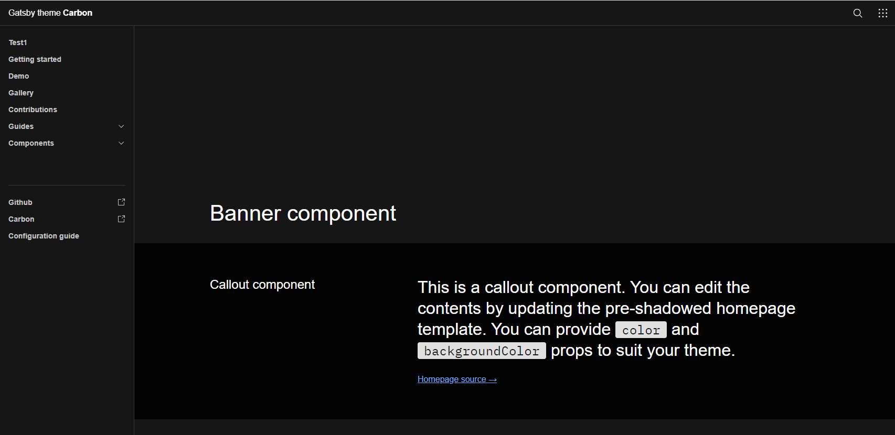

<h1 align="center">
  Gatsby Theme Carbon
  
</h1>

## 참고

- gatsby-theme-carbon (https://gatsby-theme-carbon.now.sh/getting-started/)
- npm install gatsby-cli -g

## 작업 순서
- gatsby new site-gatsby-carbon-hello https://github.com/carbon-design-system/gatsby-starter-carbon-theme
- cd site-gatsby-carbon-hello
- gatsby develop
- http://localhost:8000

## 페이지 추가
- src/pages/test1 폴더 생성
- src/pages/test1/index.mdx 생성(getting-started/index.mdx 복사)
- src/data/nav-items.yaml 수정 > title,path변경

## github 배포
- create repo : site-gatsby-carbon-hello
- git init
- git remote add origin https://github.com/algorik5/site-gatsby-carbon-hello.git
- git push -u origin master

## git pages 배포
- npm install gh-pages -g
- gatsby-config.js 수정 : pathPrefix: "/site-gatsby-carbon-hello",
- gatsby build --prefix-paths && gh-pages -d public
- https://algorik5.github.io/site-gatsby-carbon-hello/

